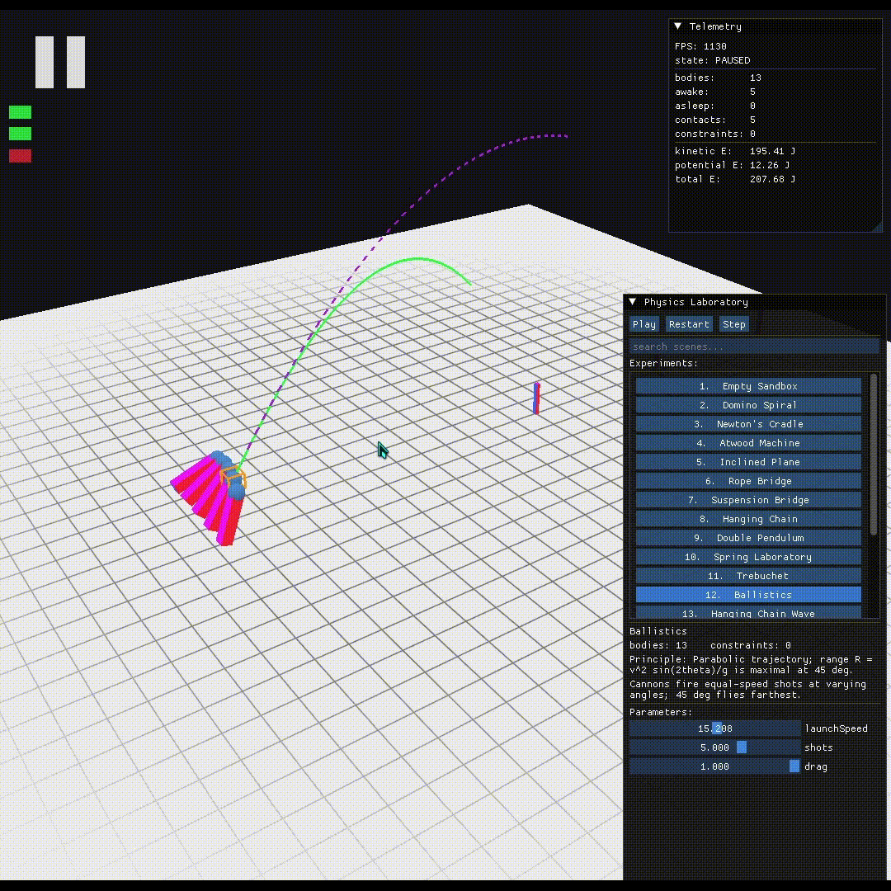
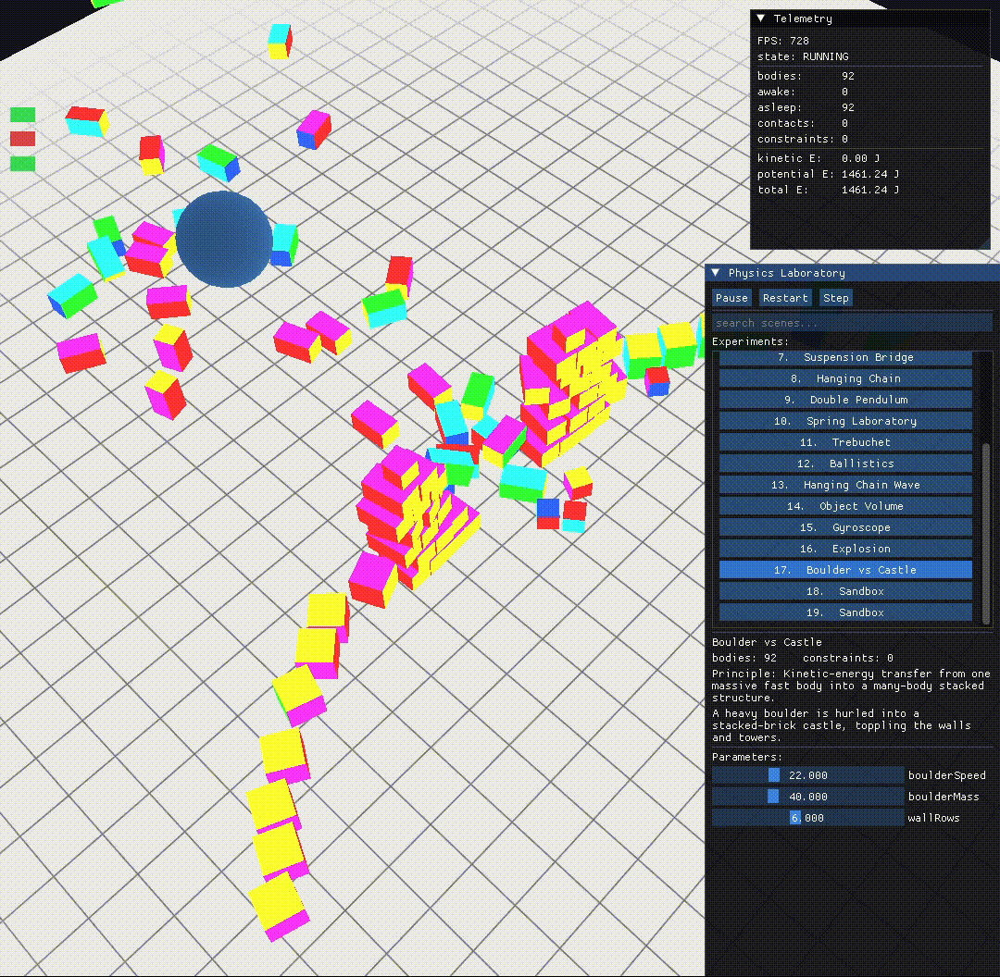
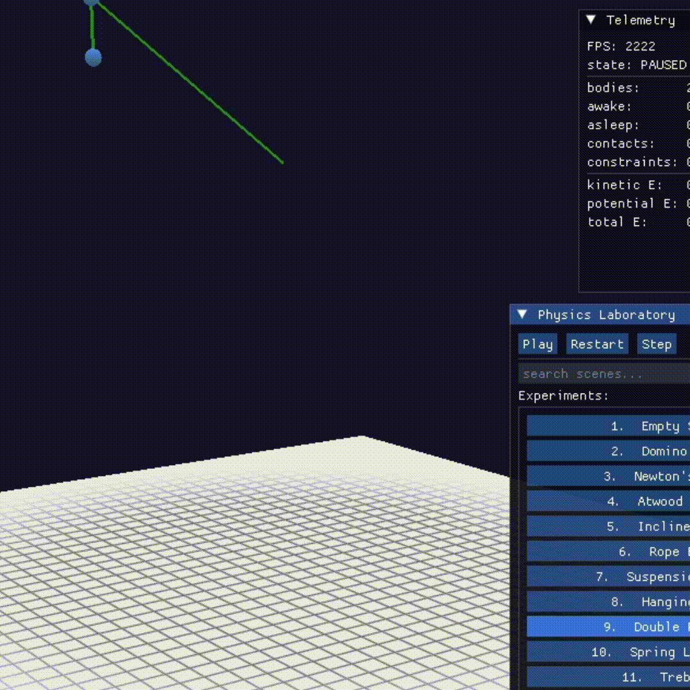
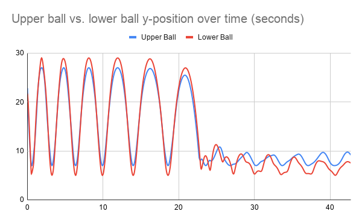
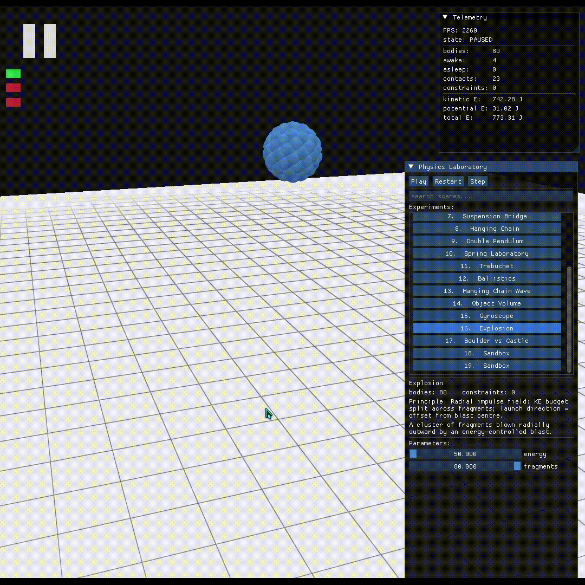
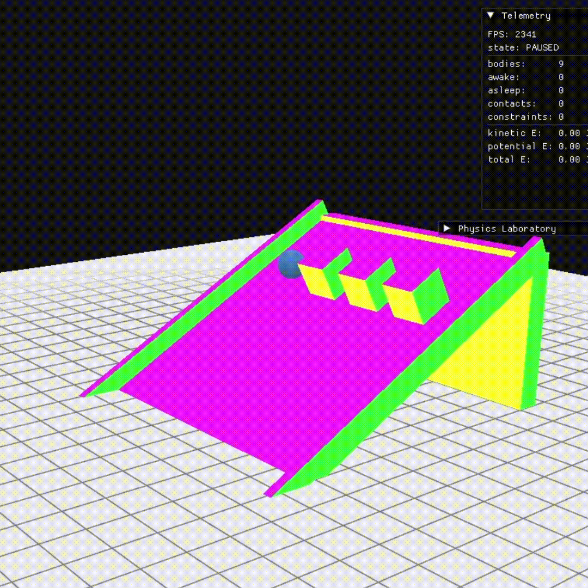

# Murad Dashdamirov — Portfolio

dashdamirov.murad11@gmail.com | [LinkedIn](https://www.linkedin.com/in/murad-dashdamirov-90461934a) | [GitHub](https://github.com/Murad-D-11)

---

## 3D Rigid-Body Physics Engine & Simulation Lab

*C++17 · OpenGL · GLM · Dear ImGui · CMake*
[GitHub repository](https://github.com/Murad-D-11/Physics) &nbsp;·&nbsp; [Technical docs (README / Architecture / Benchmarks)](https://github.com/Murad-D-11/Physics/tree/main/docs)

A 3D rigid-body physics engine written from scratch in C++ — no physics
libraries. The solver, collision detection, constraints, and continuous
collision detection are all hand-implemented, with correctness prioritized over
shortcuts (artificial damping and snapping were deliberately removed in favor of
implementations that are actually correct). Around the solver sits an
interactive OpenGL + Dear ImGui laboratory, a renderer-independent machine-
learning data layer, and three headless validation harnesses.

<!-- ===================================================================== -->
<!-- SHOWCASE. Four curated blocks, most-impressive-first. Drop your        -->
<!-- media into the docs/img/ paths below (still frames for a PDF; use the  -->
<!-- clips directly if this becomes a web portfolio). Each block leads with -->
<!-- one strong visual and folds the rest in via its caption -- do NOT add  -->
<!-- a separate entry per screenshot/clip.                                  -->
<!-- ===================================================================== -->

### Showcase

**Validated against real physics — simulated vs. predicted trajectory.**
The ballistics scene runs the true simulated path (solid) alongside a
real-time predicted trajectory (dotted) from the rollout predictor. The two
tracking each other is direct visual proof the solver reproduces the analytic
parabola.

<!-- MEDIA: ballistics recording — actual path vs. real-time prediction overlay. -->

**Instrumented for verification -- physics-inspector overlays.**
Every internal quantity can be drawn live, so behaviour is inspected. 
Shown: contact normals erupting as a boulder demolishes a stacked
brick castle. Also available: sleeping-body markers (watch them wink out along
a toppling domino cascade), center-of-mass, bounding volumes, and
angular-velocity axes.

<!-- MEDIA (pick the 2 strongest; contact-normals + sleeping-cascade recommended): -->
<!--  left  = contact normals on boulder-vs-castle impact                          -->
<!--  right = sleeping markers across the domino spiral (or angular-velocity beads) -->
|  |  |
| :---: | :---: |
| *Contact normals (yellow rods) during the boulder-vs-castle impact.* | *Sleeping markers (blue rods) clearing ahead of a domino cascade.* |

**Analyzable output — recorded data + plotted motion.**
Every run can be recorded to CSV (per-body position, velocity, orientation per
step, grouped by object). Here the two bobs of the double pendulum are recorded
and their Y-positions plotted over time — the chaotic, non-repeating traces are
the signature of a double pendulum.

<!-- MEDIA: left = the live double-pendulum scene in the program (the source   -->
<!-- of the data); right = the y-position-over-time graph plotted from its CSV. -->
|  |  |
| :---: | :---: |
| *The double-pendulum scene in the program -- the motion being recorded.* | *The two bobs' Y-positions over time, plotted from the exported CSV.* |

**Interactive & real-time -- live sliders, materials, and environment.**
Scene parameters, material presets, and the environment are all adjustable
mid-simulation. Shown: an energy-controlled blast expanding under different
environment settings, and a block on the incline that slides as steel but grips
as rubber — the same scene, different physics, driven live.

<!-- MEDIA (pick 2): explosion reacting to environment (wind/air density) on the  -->
<!-- left; a material-change clip (incline steel-vs-rubber, or Newton's cradle)    -->
<!-- on the right. The full set of scene + slider recordings is supporting         -->
<!-- material — link a demo reel rather than embedding every clip.                 -->
|  |  |
| :---: | :---: |
| *Explosion under changed environment (no change / wind / air density / no gravity).* | *Same incline, different material preset -- rubber grips, ice slides.* |

---

**Engine & architecture**

- Implemented the full simulation loop from scratch: semi-implicit (symplectic)
  Euler integration, a spatial-hash AABB broad phase, SAT-based oriented-
  bounding-box narrow phase with multi-point contact manifolds, and a warm-
  started sequential-impulse velocity solve followed by a split-impulse position
  correction that removes penetration without injecting energy.
- Modeled full rotational dynamics with quaternion orientation and per-body
  inertia tensors, applying torque from both normal and friction impulses, plus
  four constraint types — springs, hinges (with angle limits and a velocity
  motor), inextensible ropes, and pulleys.
- Enforced a strict inward dependency direction — physics knows nothing about
  rendering, and the ML layer knows nothing about OpenGL — so the same solver
  compiles into the interactive app and into four headless targets unchanged.

**Performance (measured, `dt = 1/60 s`, `-O2`)**

- Kept per-body step cost nearly flat — a **1.33× increase across a 50× growth
  in body count** (0.0047 → 0.0062 ms/body/step from 10 to 500 bodies) — by
  pruning the O(n²) pair set with a spatial hash; 500 interacting bodies solve
  in **~3.1 ms/step**, well under the 16.6 ms real-time budget at 60 Hz.
- Added conservative-advancement continuous collision detection that finds the
  earliest time-of-impact so fast movers substep to contact instead of
  tunnelling — **no tunnelling verified up to 200 m/s impacts** — at a cost of
  **< 0.5% of a step** even in a busy 500-body scene.
- Ran a 150-body domino cascade for 2,400 steps (40 s simulated) with **800 peak
  simultaneous contacts** to completion in ~2 s wall time, all bodies correctly
  reaching sleep (sleeping islands are skipped, so cost tracks the active
  wavefront rather than the total body count).

**Correctness & validation**

- Wrote a headless, deterministic validation suite of **300+ automated
  assertions across 18 categories** that drives the real solver and compares
  measured results to closed-form physics — **pendulum period within 0.2%** of
  `2π√(L/g)`, **angular-momentum conservation to ~1e-6** relative error — plus
  a scene harness that checks every scene's intended behaviour and a four-layer
  physics validation lab.
- Held numerical stability under adversarial sweeps: stacks stable to a
  **1000:1 mass ratio** with near-zero penetration, correct resting heights
  from 0.05 m to 5 m bodies, and Coulomb-correct slope slide/hold behaviour
  across friction coefficients.
- Documented the engine's real limits honestly rather than faking them — e.g.
  the sequential-impulse integrator dissipates gyroscopic coupling (so a true
  precessing gyroscope isn't reproduced), and a cantilever scene was removed
  because the solver has no bending-stiffness primitive.

**Tooling & machine-learning layer**

- Built an interactive Dear ImGui laboratory: a searchable browser of **~17
  tunable, deterministic scenes** (Newton's cradle, Atwood machine, trebuchet,
  domino spiral, a many-body contact stress test, an energy-controlled
  explosion, a boulder-vs-castle demolition, and more), each with live parameter
  sliders, a real-time energy/momentum/contacts telemetry panel, and five
  physics-inspector overlays.
- Engineered a rendering-independent research layer: a gym-style `Environment`
  (`reset` / `step` / `observe` / `act`), a **deterministic CSV dataset
  generator** that emits supervised state → future-position samples reproducible
  from a seed, and a swappable trajectory predictor with an ONNX slot that falls
  back to a real physics rollout — enabling ML experiments with zero OpenGL
  dependency.

---

<!-- Add your next portfolio project below, following the same structure:   -->
<!--   ## Project Title                                                      -->
<!--   *tech stack* + links                                                  -->
<!--   1–2 sentence description                                              -->
<!--   images (half the space) + bullets grouped by concern                  -->
